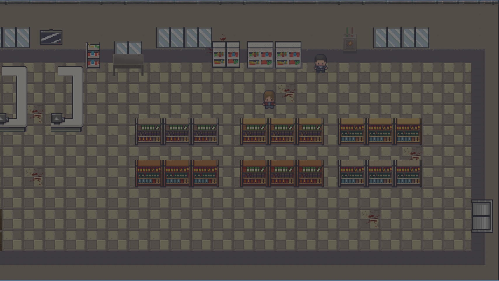
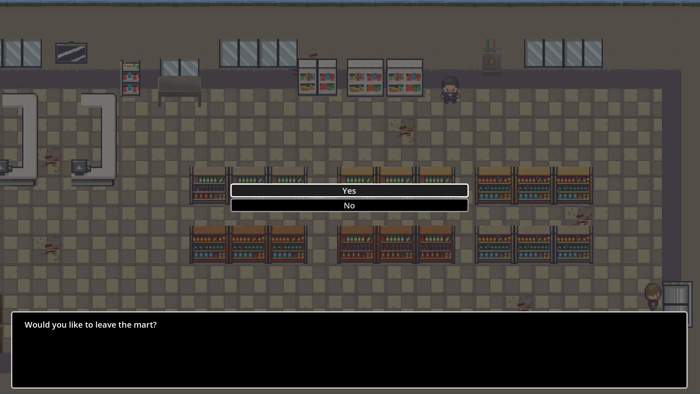
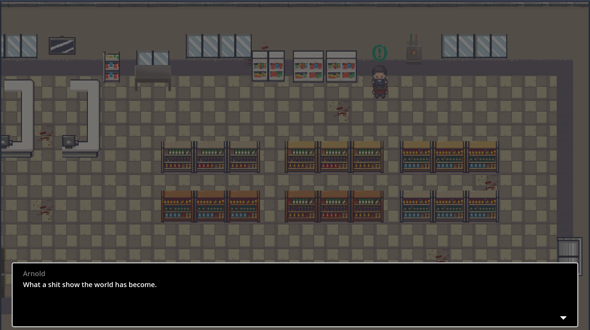

This project uses AI to help make it come to life. For now I have used ChatGPT primarily to figure out the issue of conflicts and ask it's opinion on if what I'm trying to do or if my vision is possible within Godot.

Prompts Include:

"How to make the effect where when you walk behind a shelf you will see the vision of yourself behind the shelf and the shelf layers on top of you but is transparant"

"In Godot, how do I make it where if I interact with an NPC, it shows dialogue box and portrait like this"

"How to achieve this directional lighting on Godot?"

Video Link: https://www.youtube.com/watch?v=RoXCbw2IrCw

