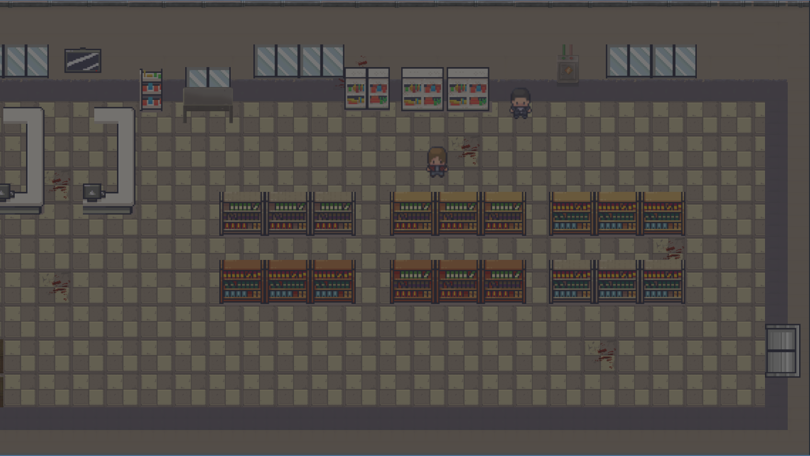
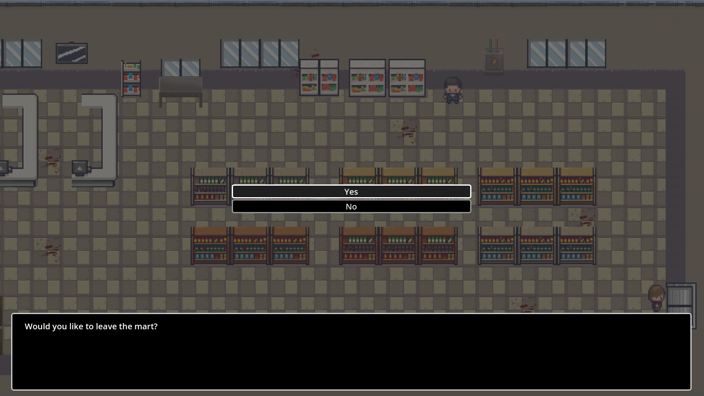
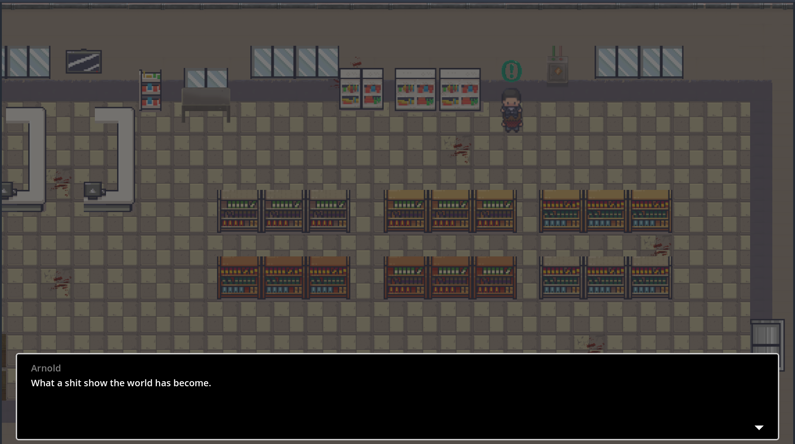
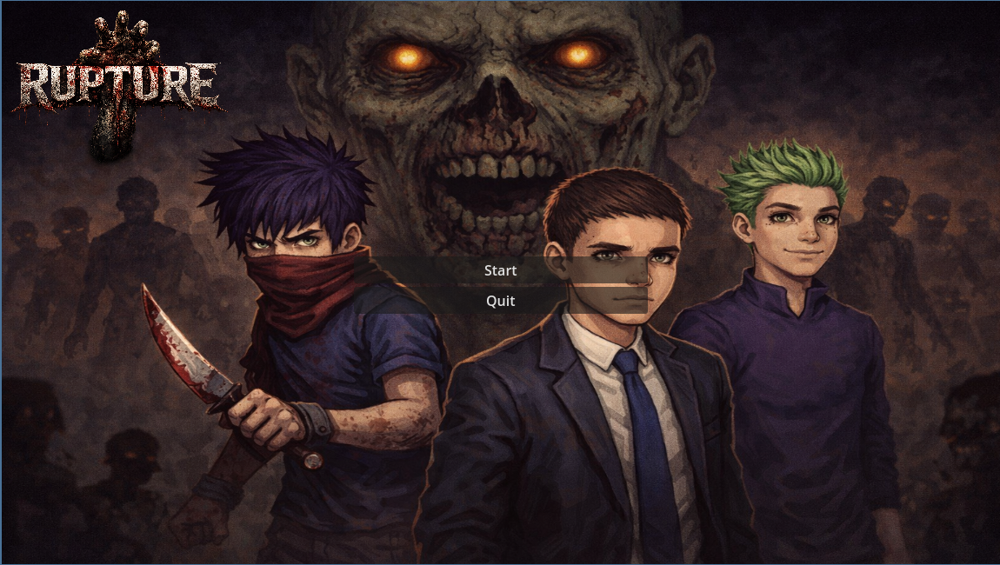
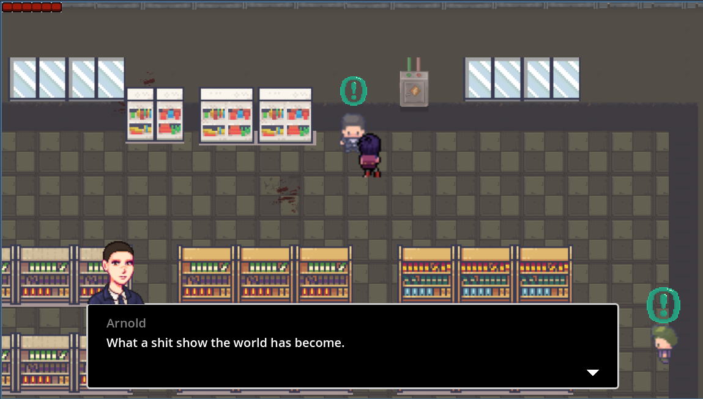
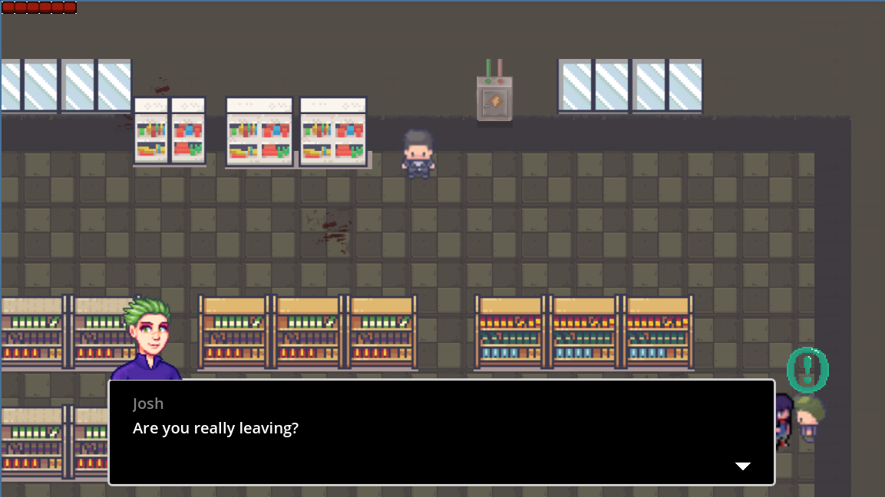
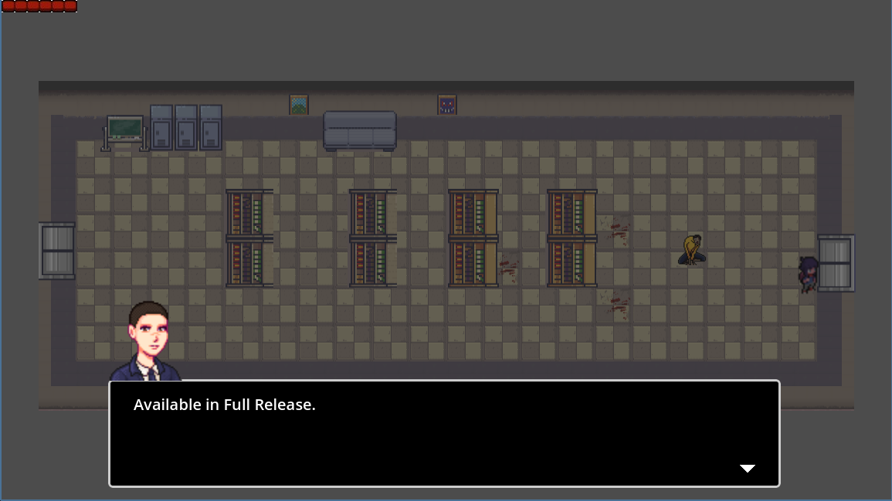

This project uses AI to help make it come to life. For now I have used ChatGPT and Claude to figure out the issue of conflicts and ask it's opinion on if what I'm trying to do or if my vision is possible within Godot.

Prompts Include:
ChatGPT: 
"How to make the effect where when you walk behind a shelf you will see the vision of yourself behind the shelf and the shelf layers on top of you but is transparant"

"In Godot, how do I make it where if I interact with an NPC, it shows dialogue box and portrait like this"

"How to achieve this directional lighting on Godot?"

"Generate a game Logo for my game RupturE with a zombie hand gripping on the text"

"Generate a game background for my main menu using these NPCs inspired by the picture above"

Prompts from Claude AI:

"So in Godot dialogue manager, I have balloon.tscn and balloon.gd. This is the diialogue bubble used for most dialogue. How do I have different balloon/dialogue box for different dialogue since I have different Portrait for each dialogues"

"There was an error when I made changes: Error at (16, 77): Too many arguments for "show_dialogue_balloon()" call. Expected at most 3 but received 4."

"How do I change my scene to martstorage.tscn after I click yes in the dialogue interaction"

"I have this issue where when I talk to someone all 3 dialogues play instead of just the one I interacted with. What caused this issue to happen?"

"Now here's another problem, now when I click yes it works, but as soon as I move in the next scene it takes me back to Mart.tscn and every interaction doesn't work after."

Video Link: https://www.youtube.com/watch?v=RoXCbw2IrCw

Beta Update: https://youtu.be/amUBx3RhYsY

