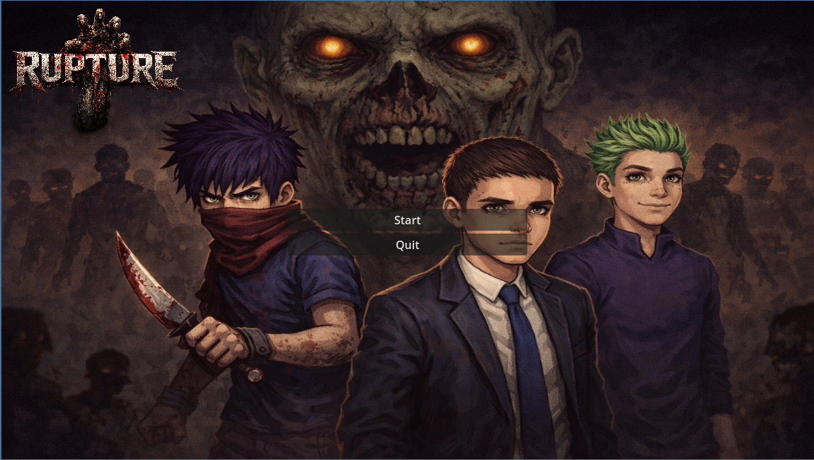
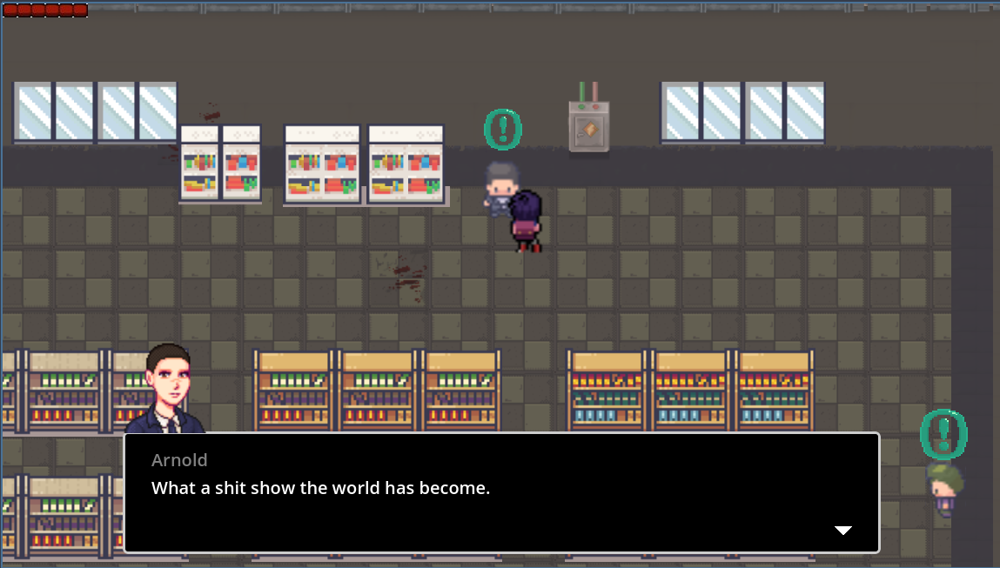
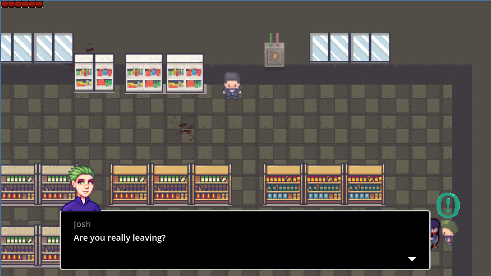
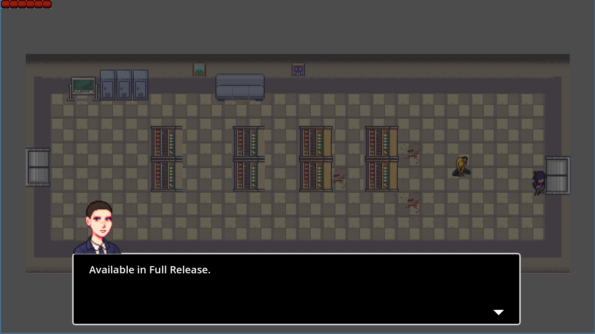
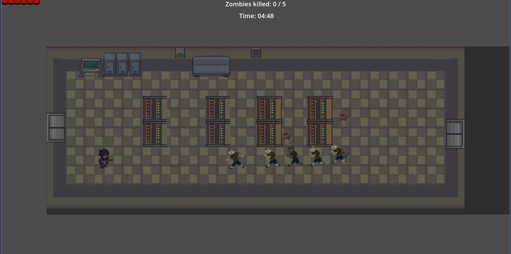
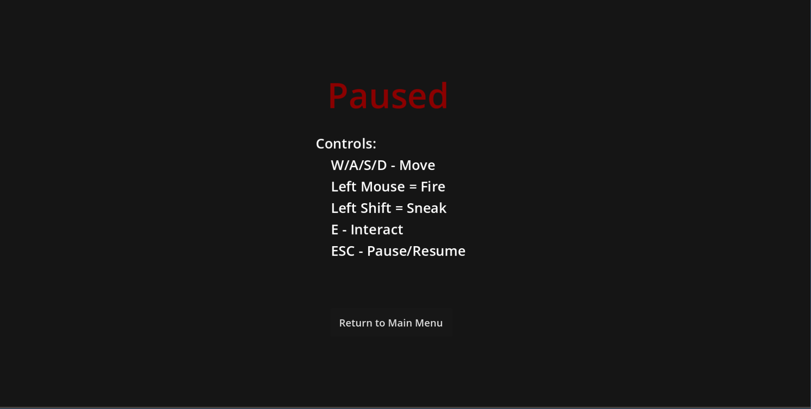
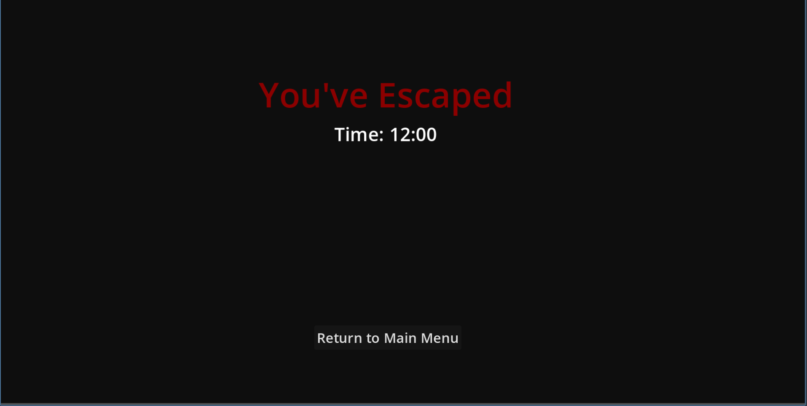

# RupturE
A pixelated 2D zombie survival game built with Godot Engine. Escape the mart by eliminating all zombies while managing your health and time!

**Repository:** https://github.com/SodavithNuon/RupturE2D

## Gameplay Overview

- **Objective:** Eliminate all zombies in the storage facility to escape
- **Timer:** Real-time speedrun timer (seconds:milliseconds)
- **Health System:** 100 health points per run
- **Controls:** WASD to move, Left Mouse to shoot, ESC to pause, E to interact

## Installation & Running

### Prerequisites
- [Godot Engine 4.5.x or later](https://godotengine.org/)

### Clone via Git
```bash
# Clone the repository
git clone https://github.com/SodavithNuon/RupturE2D

# Navigate to project folder
cd RupturE2D
```

### Running the Game
1. Download the latest RupturE2D.exe from the Releases page
2. Run the executable file
3. Play!

## Game Features

- **Pause Menu:** Press ESC to pause/resume game
- **Dialogue System:** Interactive NPC conversations with character portraits
- **Dynamic Lighting:** Directional lighting effects for atmosphere
- **Y-Sorting:** Proper sprite layering for depth perception
- **Zombie AI:** Zombies navigate toward the player avoiding obstacles
- **Sound Design:** Footsteps, gunfire, ambient music, and zombie sounds
- **Speedrun Timer:** Track your escape time in real-time

## Credits

### Characters & Sprites

| Asset | Creator | Link |
|-------|---------|------|
| The Adventurer (Player) | Sscary | https://sscary.itch.io/the-adventurer-male |
| Zombie Sprite | IronnButterfly | https://ironnbutterfly.itch.io/zombie-sprite |

### Maps & Tilesets

| Asset | Creator | Link |
|-------|---------|------|
| Horror Lab (Top-Down) | kamisama887 | https://kamisama887.itch.io/horror-lab-top-down |
| Modern Interiors | LimeZu | https://limezu.itch.io/moderninteriors |

### Weapons & Projectiles

| Asset | Creator | Link |
|-------|---------|------|
| Fire Pixel Bullet (16x16) | BDragon1727 | https://bdragon1727.itch.io/fire-pixel-bullet-16x16 |
| High Quality Free Pixel Art Guns | ivL0rd | https://ivl0rd.itch.io/highquality-free-pixel-art-guns |

### Audio - Sound Effects

| Asset | Creator | Link |
|-------|---------|------|
| Footsteps Sounds | Dryoma | https://dryoma.itch.io/footsteps-sounds |
| Snake's Second Authentic Gun Sounds Pack | SnakeF8 | https://f8studios.itch.io/snakes-second-authentic-gun-sounds-pack |
| Pain Sounds (Male) | VoiceBosch | https://voicebosch.itch.io/taking-damage-sounds-male-grunts-audio-pack |
| Zombie Massacre Sound Effects Starter Pack | TerrorByteGames | https://terrorbytegames.itch.io/zombie-massacre-sound-effects-starter-pack |
| Heart Beats Sound Effects | Tagirijus | https://tagirijus.itch.io/heart-beats-sound-effects |

### Audio - Music

| Asset | Creator | Link |
|-------|---------|------|
| The Last: Post-Apocalyptic/Ambient Music Asset Pack | DavidKBD | https://davidkbd.itch.io/the-last-post-apocalypticambient-music-asset-pack |

### UI & Character Creation

| Asset | Creator | Link |
|-------|---------|------|
| Stardew Valley Character Portrait Maker | jazzybee | https://jazzybee.itch.io/sdvcharactercreator |

## Development Notes

This project uses AI to help make it come to life. For now I have used ChatGPT and Claude to figure out the issue of conflicts and ask it's opinion on if what I'm trying to do or if my vision is possible within Godot.

### Prompts Include:

**ChatGPT:**
- "How to make the effect where when you walk behind a shelf you will see the vision of yourself behind the shelf and the shelf layers on top of you but is transparant"
- "In Godot, how do I make it where if I interact with an NPC, it shows dialogue box and portrait like this"
- "How to achieve this directional lighting on Godot?"
- "Generate a game Logo for my game RupturE with a zombie hand gripping on the text"
- "Generate a game background for my main menu using these NPCs inspired by the picture above"

**Claude AI:**
- "So in Godot dialogue manager, I have balloon.tscn and balloon.gd. This is the diialogue bubble used for most dialogue. How do I have different balloon/dialogue box for different dialogue since I have different Portrait for each dialogues"
- "There was an error when I made changes: Error at (16, 77): Too many arguments for "show_dialogue_balloon()" call. Expected at most 3 but received 4."
- "How do I change my scene to martstorage.tscn after I click yes in the dialogue interaction"
- "I have this issue where when I talk to someone all 3 dialogues play instead of just the one I interacted with. What caused this issue to happen?"
- "Now here's another problem, now when I click yes it works, but as soon as I move in the next scene it takes me back to Mart.tscn and every interaction doesn't work after."
- "How to add sound for evety projectile fire"
- "I want to add a zombie count and a timer that counts and acts as a speedrun timer in seconds and milliseconds to this level"
- "How to make the zombies navigate to my player as they just get stuck at the obstacles"

## 📸 Screenshots

### Main Menu


### Dialogue System



### Gameplay



### Pause Menu


### Ending Screen


## Video Showcase

**Original Concept:** https://www.youtube.com/watch?v=RoXCbw2IrCw

**Beta Update:** https://youtu.be/amUBx3RhYsY

**Final Version:** https://youtu.be/RE5VksFNlCA

## License

This project uses assets from various creators on itch.io under their respective licenses. Please refer to each creator's page for license details.

## Developer

**Sodavith Nuon**

**Made with Godot Engine 4.5.x**